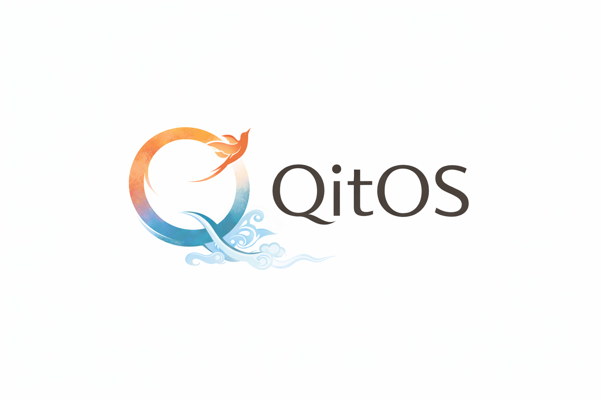

# QitOS

QitOS is the torch-flavor framework for agent researchers.

Prototype methods, run benchmarks, and inspect long-horizon trajectories on one `AgentModule + Engine` kernel with built-in `qita` observability.

QitOS core is the small framework. Product-grade applications and showcase agents live in `qitos-zoo`, including planned apps such as `qitos-coder` and `qitos-cyber-agent`.

[Quickstart](https://qitor.mintlify.app/quickstart) · [Tutorial Track](https://qitor.mintlify.app/tutorials/index) · [Benchmarks](https://qitor.mintlify.app/benchmarks/overview) · [CLI Reference](https://qitor.mintlify.app/reference/cli) · [Changelog](CHANGELOG.md) · [Chinese README](README.zh.md)

## What you can build

QitOS is a research-first Agent framework: one `AgentModule + Engine` kernel,
with Session ownership, pause, durable recovery and fork. Extend tools,
providers, context, stores, sinks and sandboxes; inspect Trajectory through
read-only qita. Framework correctness does not guarantee arbitrary model task success.

## What's New

- Observation attribute and mapping writes now stay consistent, with atomic validation and independent serialization snapshots.

- Legacy Read/Edit now preserve line windows, reject ambiguous edits and expose canonical failure results.

- Same-Session handoff persists admission before dispatch; destination restore and completion are independent of late source callbacks.

- Self-contained web tutorials: complete notes-Agent code, bilingual learning path and source-checked core API reference; tests execute the files shown on each page.

- The [v5 iteration roadmap](docs/v5/README.md) now records four delivered R1 candidates: model I/O, memory/compaction, runtime correctness and bounded trajectory consumption. An [independent review](docs/internal/plans/v5_r1_integration_review.md) reran 198 tests and identified five bounded repairs before combined qualification; these candidates are not yet integrated into master.

- Master fixes Python 3.10 publication, repeated journal parsing and portable historical evidence verification; these are separately tested successors to the historical G5 runtime.

- G5 framework qualification passed; S4 local integration complete. Runtime identity: `717b4cf1b23f2ed252cd03234ffd8605038d9567`.
- Bilingual docs converge on installation → project → configuration → Session → inspection → recovery/extension.
- The default development branch is `master`, with CI/docs checks on pushes and PRs. Publication remains explicit.
- Documentation/tutorial qualification is recorded separately. Remote synchronization is verified. Docs CI passed; successor CI stabilization is tracked with exact results in the [CI plan](docs/internal/plans/master_ci_stabilization.md). Package releases and documentation deployments are tracked separately from CI qualification.

## Start developing

`pip install qitos` selects a published PyPI version, not an identity for unreleased G5.
Follow [Installation](docs/installation.mdx), then the
[credential-free Quickstart](docs/quickstart.mdx).
Real providers use [agent.yaml, CredentialRef and an explicit resolver](docs/reference/configuration.mdx).
Docker file tools fail closed when unavailable; they do not fall back to host execution.

## Learn and contribute

- [Eight learning units](docs/tutorials/index.mdx): custom Agents, parallel tools, Sessions, context/memory, sandbox/artifacts, multi-agent work, qita and third-party extensions.
- [Complete teaching files](examples/tutorials) and [example directory](examples/README.md).
- [Migration, limits and troubleshooting](docs/reference/g5-migration.mdx).
- [Contributing](docs/contributing/development.mdx) and [architecture](ARCHITECTURE.md).
- [CHANGELOG](CHANGELOG.md), [historical engineering progress](docs/progress.md) and [G5 evidence](docs/internal/plans/s4_g5_convergence_execution.md).

The historical 2663 passed / 50 skipped result belongs only to the runtime SHA
above, on Python 3.12.7. Advanced `AgentModule.run()` and historical trace
compatibility remain supported; they are not a second beginner path.
