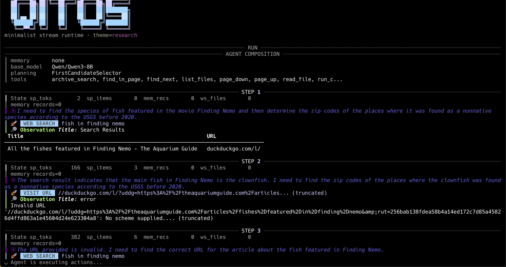
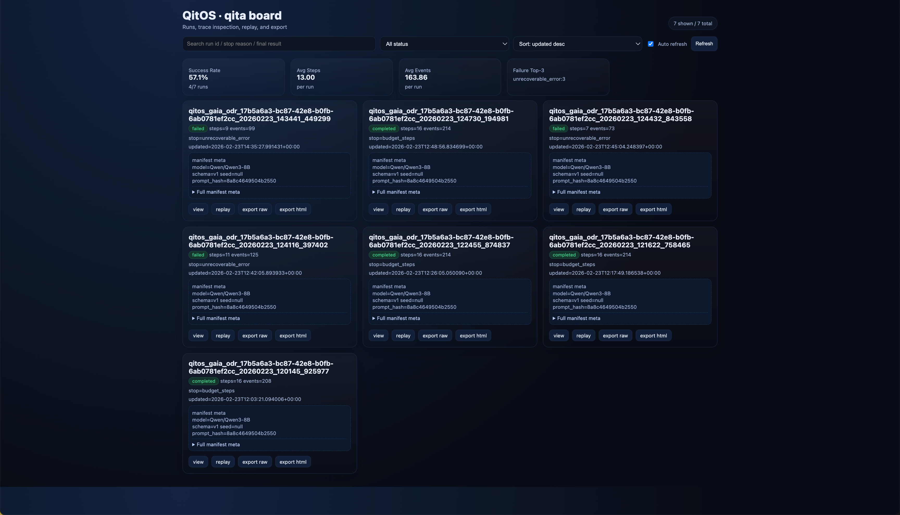
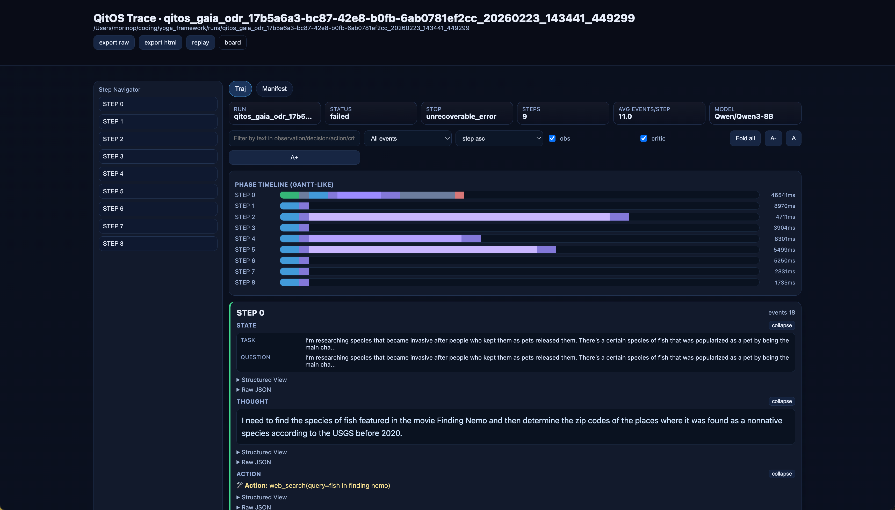

# QitOS


[](https://www.python.org/)
[](LICENSE)
[](https://qitor.mintlify.app/)
[](https://pypi.org/project/qitos/)
[](https://github.com/Qitor/qitos)

QitOS is the torch-flavor framework for agent researchers.

Prototype methods, run benchmarks, and inspect long-horizon trajectories on one `AgentModule + Engine` kernel with built-in `qita` observability.

QitOS core is the small framework. Product-grade applications and showcase agents live in `qitos-zoo`, including planned apps such as `qitos-coder` and `qitos-cyber-agent`.

[Quickstart](https://qitor.mintlify.app/quickstart) · [Tutorial Track](https://qitor.mintlify.app/tutorials) · [Benchmarks](https://qitor.mintlify.app/benchmarks/overview) · [CLI Reference](https://qitor.mintlify.app/reference/cli) · [Changelog](CHANGELOG.md) · [Chinese README](README.zh.md)

## What's New

- **S1 contract candidates delivered; G2 convergence next**: four clean branches now define session/snapshot, request/context, effect/work-graph, and lineage/readiness candidates. An isolated combined tree passes `1999 passed, 50 skipped`, the 399-finding ratchet, and stable lint/type, but independent probes found unresolved cross-lane identity, snapshot, ArtifactRef, ToolResult migration, diagnostic-safety, and interface-budget boundaries. They are not merged or runtime-ready; one A → C → B → D G2 convergence task comes next.
- **Durable-session and native multi-agent architecture**: [Task 12](docs/v4/12-session-runtime-and-persistence.md) defines one canonical checkpoint-backed session truth for safe pause, fresh-process resume, fork, and effect-aware recovery; [Task 13](docs/v4/13-durable-multi-agent-work-graph.md) defines distinct handoff, delegate, fan-out, spawn, fork, steer, and join semantics over durable work items. The [four-lane playbook](docs/v4/11-four-lane-execution-playbook.md) now makes quality a cross-lane gate after G1 and assigns future capacity to Session, Conversation/Context, Tools/Multi-Agent, and Trajectory/qita/DX.
- **Qualified static ratchet and executable contribution gates**: deterministic tests prove every critical baseline transition, while the tool-schema workflow and repository tests now execute one checked-in entrypoint over real registered class tools, including a controlled malformed-spec failure. Required-candidate, advisory, stale, and release-only workflow roles remain explicit without claiming access to branch-protection settings.
- **Evidence-backed v4 integration ledger**: [`docs/progress.md`](docs/progress.md) now records exact lane heads, integration dispositions, executable reviewer probes, cross-lane contract blockers, merge order, and G1/G2 checklists. The convergence-wave branches are tracked separately from what is actually present and qualified on the integration branch.
- **Canonical tool outcomes and runtime ownership**: `ToolResult` is the single lossless action/tool outcome, while `ActionResult`, historical dictionaries, and `model_summary` adapt at compatibility boundaries. A structural schema hard gate, lifecycle ownership matrix, deterministic durability-race proof, and schema-bearing Lane B/D fixtures establish the Task 03A/09A contract without changing coding-tool, checkpoint, or MCP transport behavior.
- **ToolResult contract hardening**: canonical persistence no longer flattens output, versioned payloads parse strictly, legacy flattening is explicit, and model/trace-safe views use bounded redacted allowlists. Malformed schemas and interceptor/permission argument rewrites now fail the shared structural gate before tool code; the C1-R fixture records the exact Lane B/D handoff without claiming full trajectory privacy.
- **G1 ToolResult boundary closed**: recursive JSON-only arguments fail before interceptors, permissions, and tool code; nested canonical/legacy values are ownership-isolated; model/trace-visible mapping keys use collision-safe redaction; and forced-secret scalar content is separated from typed trace-safe omitted counts with explicit aggregate and per-field loss accounting.
- **Repository-wide static quality ratchet**: one pinned Python/flake8/mypy command now checks every active `qitos` package against a committed, classified baseline. New findings fail CI, resolved findings force the baseline to shrink, stable core/engine/models/trace gates remain zero-debt, and correctness findings are handed to their semantic lanes instead of being relabeled as cleanup.
- **Engineering-quality audit and evidence gates**: the [evidence-backed audit](docs/engineering-quality-audit.md) covers whole-package gates, failure/durability semantics, resource lifecycle, duplicated abstractions, optional dependencies, and test trust. Its initial Quality, Conversation/Context, Tool/Runtime, and Trajectory/Convergence lanes remain the G1 repair history; after G1 the same ratchet and evidence rules guard all four capability lanes.
- **Canonical conversation transaction contract**: module-level `qitos.core.conversation` now embeds the sole canonical `ToolResult` rather than duplicating outcome fields, delegates persistence/model/trace views to C, strictly reads ExchangeLog v2 with typed failures, preserves crash-honest partial completion order and steering, and directly qualifies against the committed C fixture. Engine/provider defaults and Task 02B remain pending.
- **Trajectory data-plane evidence before migration**: the [Lane D D1/D1-R plan](docs/internal/plans/lane_d_data_convergence.md) maps every current runtime/trace/tracing/render/qita/checkpoint and distribution path, records public-surface removal blockers, selects two privacy-gated fixture sources, and provides strict manifest/publication/portability validation with per-contract typed readiness receipts. It does not change trace v1 or qita, publish sensitive fixtures, claim compression gains, complete 05A, or freeze trajectory v2.
- **Verified producer receipts**: D readiness now derives B/C qualification from an approved authority plus exact producer commit, committed fixture/evidence paths, and byte hashes. Forged receipt fields fail with typed blockers and one receipt clears only its own contract; publication remains unqualified and trajectory v2 stays unfrozen.
- **Neutral transport and container controls**: OpenAI-compatible models accept caller-owned `default_headers`, while `DockerEnv` accepts explicit `container_env` mappings and keeps absolute in-container paths intact—without importing campaign routing or environment policy.
- **Repository architecture harness**: a recovered-architecture audit, module boundary matrix with target dependency graph, task-oriented change guide, and P0/P1/P2 architecture-debt inventory now live under `docs/architecture/`; layered `AGENTS.md` working agreements (root + `qitos/` + core/engine/kit) tell coding agents what each layer owns, what it must not depend on, and where changes belong.
- **Mechanical architecture guardrails**: `tests/test_architecture_boundaries.py` enforces dependency direction as a ratchet (legacy violations pinned on a shrinking allowlist), fails on new module-level import cycles, and validates harness docs and their links — keeping the framework's layering enforceable, not aspirational.
- **Consistent immediate cancellation traces**: once the Engine observes an immediate cancellation, State, task/result objects, END events, and trace manifests now agree on `cancelled_immediate`; qita sees the manifest as `stopped` rather than a normal completion.
- **No false completion for structured action text**: when a native-tool model emits malformed action fields as text instead of `tool_calls`, QitOS now keeps the parser recovery path rather than treating that text as a final answer; ordinary natural-language conclusions remain unchanged.
- **Window-safe native tool history**: model requests now discard orphan tool results when a message window evicts their assistant declaration, preventing long-running parallel-tool agents from sending invalid `tool_call_id` chains while preserving complete rounds and existing recovery behavior.
- **Preset-aware direct Engine construction**: `Engine(agent=...)` now honors protocols attached by `build_model_for_preset(...)`, so provider aliases such as Kimi K3 keep JSON/native API tool delivery instead of silently falling back to text ReAct.
- **Bounded empty-response recovery**: model responses with neither usable text nor tool calls are now classified as traceable `model_error` failures, retried once, and stopped cleanly if they repeat instead of consuming the full agent step budget as parser waits.
- **Optional OpenAI Responses API transport**: set `api_mode="responses"` (or YAML `api_mode: responses`) to preserve typed output items, parallel function calls, `call_id` tool results, streaming events, and replayable tool context. Existing Chat Completions behavior remains the default.
- **Native response extraction hardening**: null-content OpenAI-compatible messages no longer surface SDK repr strings as final answers.
- **OpenAI-compatible request hardening**: forced tool-call requests now avoid provider thinking-mode conflicts, and JSON/tool-call parsing repairs bare control characters inside string values.
- **More robust JSON salvage**: JSON-like parser recovery now ignores apostrophes in surrounding prose, so contractions before a valid payload no longer hide the object.
- **Cleaner delegate tools**: `AgentSpec.tool_name` lets multi-agent systems expose task-oriented tool names, and `DelegateTool` now delivers structured `context` payloads into child agents.
- **CyberGym integration hardening**: v0.6 integration runs now preserve valid OpenAI-compatible tool schemas, redact persisted secrets across traces/results/render artifacts, and keep CyberGym PoC-generation shell commands out of the interactive review path while preserving the default coding-tool guard.
- **Lighter-weight CyberGym bootstrap guidance**: the CyberGym PoC agent now derives a compact task-spec summary, ranks likely parser/harness/sample paths more aggressively, tracks richer candidate provenance, and records a lightweight internal failure taxonomy without changing the single-agent runtime.

## What's New in v0.5.0

- **12 method templates**: ReAct, PlanAct, SWE-Agent, Voyager, Debate, Manager-Worker, Planner-Executor, Self-Refine, Reflexion, LATS, MoA, and Magentic-One — each with paper.md, config.yaml, and recipe implementations.
- **`qit new` CLI**: Scaffold a new agent project from built-in templates with `qit new --template <name>`.
- **Export APIs**: `EngineConfig`, `ToolPermissionSpec`, `CriticTrace`, and `HandoffTrace` for programmatic access to engine configuration and trace data.
- **Tracing integrations**: W&B (`WandbTraceProcessor`) and MLflow (`MlflowTraceProcessor`) for experiment tracking.
- **FamilyPreset extensibility**: `override()`, `recommended_*` advisory fields, and `MaxTokensCriteria` stop criterion.
- **qita cost panel**: Token usage and cost metrics in the run overview.

See [CHANGELOG.md](CHANGELOG.md) for the full list.

## Live Terminal of QitOS for Code Review

<p align="center">
  
</p>

## Who QitOS is For

- **Method researchers** who want to change prompts, parsers, critics, tools, and memory policies without rewriting the runtime.
- **Benchmark users** who want GAIA, Tau-Bench, and CyBench workflows on the same kernel they use for agent development.
- **Long-running agent debuggers** who care about trajectory review, replay, diff, and context-collapse diagnosis instead of app scaffolding alone.

## Run QitOS in 2 Minutes

The minimal agent in QitOS is a minimal **coding agent**. It configures a real model, works inside a workspace, edits code, runs a verification command, and leaves behind a qita-ready trace.

```bash
pip install "qitos[models]"
export OPENAI_API_KEY="sk-..."
qit --version
qit demo minimal
qita board --logdir runs
```

Optional but common for OpenAI-compatible providers:

```bash
export OPENAI_BASE_URL="https://api.siliconflow.cn/v1/"
export QITOS_MODEL="Qwen/Qwen3-8B"
```

`qit demo minimal` seeds a tiny buggy workspace, asks a model-backed coding agent to fix it, verifies the patch, and writes the trajectory to `./runs`.

Then go deeper:

- Want ReAct? See [`examples/patterns/react.py`](examples/patterns/react.py)
- Want a coding agent? See [`examples/real/coding_agent.py`](examples/real/coding_agent.py)
- Want benchmarks? Start with the [benchmark guides](https://qitor.mintlify.app/benchmarks/overview)
- Want method templates? See [Method Templates Guide](https://qitor.mintlify.app/guides/method-templates)

## Why QitOS

| If you want... | QitOS gives you... |
|---|---|
| reproducible agent research | a stable `AgentModule + Engine` kernel |
| method = Agent + Critic | 12 built-in method templates with paper mappings |
| observability | `qita` board, replay, export, and trace artifacts |
| benchmark workflows | GAIA, Tau-Bench, and CyBench adapters |
| less framework glue code | one canonical execution loop |

## Method Templates

QitOS ships 12 method templates — each is an Agent + Critic pair implementing a well-known agentic reasoning pattern:

| Template | Pattern | Paper |
|----------|---------|-------|
| ReAct | Reason + Act | Yao et al. 2023 |
| PlanAct | Plan then Execute | — |
| SWE-Agent | Software Engineering | Princeton 2024 |
| Voyager | Open-ended Exploration | Wang et al. 2023 |
| Debate | Multi-agent Debate | — |
| Manager-Worker | Orchestration with Delegation | — |
| Planner-Executor | Plan Decomposition | — |
| Self-Refine | Generate → Critique → Refine | Madaan et al. 2023 |
| Reflexion | Act → Reflect → Retry | Shinn et al. 2023 |
| LATS | Monte Carlo Tree Search | Zhou et al. 2023 |
| MoA | Parallel Proposals + Aggregation | Wang et al. 2024 |
| Magentic-One | Orchestrator + Specialists | Furtado et al. 2024 |

Use them directly:

```python
from qitos.recipes.reflexion import ReflexionAgent, ReflexionCritic

agent = ReflexionAgent(llm=my_llm)
result = agent.run(
    task="Debug the failing test",
    critics=[ReflexionCritic(max_reflections=3)],
    max_steps=15,
    return_state=True,
)
```

Or scaffold a new agent from any template:

```bash
pip install qitos[cookiecutter]
qit new --agent-name my_agent --agent-description "My custom agent"
qit list-templates
```

## Tooling Layout

QiTOS separates tool imports into three layers:

- `qitos.kit`: the simplest curated entrypoint for common toolsets
- `qitos.kit.toolset`: scenario-oriented presets and registry builders
- `qitos.kit.tool.<domain>`: advanced atomic capability imports

Default composition is list-first:

```python
from qitos import ToolRegistry
from qitos.kit.tool.file import ReadFile
from qitos.kit.toolset import coding_tools

registry = ToolRegistry().include_toolset(
    [
        ReadFile(workspace_root="."),
        coding_tools(workspace_root="."),
    ]
)
```

Security-sensitive tools are explicit opt-in imports and are not part of `qitos`, `qitos.kit`, `qit demo`, or the quickstart path.

## Documentation Map

- Start here: [Introduction](https://qitor.mintlify.app/introduction)
- First successful run: [Quickstart](https://qitor.mintlify.app/quickstart)
- Install options: [Installation](https://qitor.mintlify.app/installation)
- Build your own minimal coding agent: [First Agent](https://qitor.mintlify.app/guides/build-your-first-agent)
- Method templates: [Method Templates Guide](https://qitor.mintlify.app/guides/method-templates)
- Learn the runtime: [AgentModule](https://qitor.mintlify.app/concepts/agent-module) / [Engine](https://qitor.mintlify.app/concepts/engine)
- Inspect traces: [Observability](https://qitor.mintlify.app/guides/observability)
- Follow the course: [Tutorials](https://qitor.mintlify.app/tutorials)
- Run benchmarks: [Benchmarks Overview](https://qitor.mintlify.app/benchmarks/overview)
- Check commands: [CLI Reference](https://qitor.mintlify.app/reference/cli)
- Need API details: [API Reference](https://qitor.mintlify.app/reference/api)

## Preview

<table>
  <tr>
    <td align="center"><strong>QitOS CLI</strong></td>
    <td align="center"><strong>qita Board</strong></td>
    <td align="center"><strong>qita Trajectory View</strong></td>
  </tr>
  <tr>
    <td align="center">
      <a href="assets/qitos_cli_snapshot.png">
        
      </a>
    </td>
    <td align="center">
      <a href="assets/qita_board_snapshot.png">
        
      </a>
    </td>
    <td align="center">
      <a href="assets/qita_traj_snapshot.png">
        
      </a>
    </td>
  </tr>
</table>

## Status

QitOS is currently **Beta**.

- Stable direction: `AgentModule + Engine`, trace/qita flow, canonical examples, benchmark adapters, and official reproducible-run contracts.
- Likely to evolve: higher-level convenience APIs, some `kit` modules, and experimental toolsets.
- If you are evaluating adoption, start from the kernel and examples, not assumptions about frozen surface area.
- For ongoing project evolution and upgrade notes, see [CHANGELOG.md](CHANGELOG.md).

## Installation and Versions

- Supported Python version: **3.10+**
- User install: `pip install "qitos[models]"`
- Version check: `qit --version`
- Minimal coding agent: `qit demo minimal`
- Optional provider config: `OPENAI_API_KEY`, `OPENAI_BASE_URL`, `QITOS_MODEL`
- Core-only install: `pip install qitos`
- Repo source install: `pip install -r requirements.txt`
- Full contributor install: `pip install -r requirements-dev.txt`
- Optional extras: `qitos[wandb]`, `qitos[mlflow]`, `qitos[cookiecutter]`, `qitos[all]`
- Installation guide: [Installation](https://qitor.mintlify.app/installation)

## Contributing

Contributions are welcome, especially around method templates, benchmark adapters, memory/history workflows, qita UX, and framework contracts. Product-grade agents should target `qitos-zoo`. Start with [CONTRIBUTING.md](CONTRIBUTING.md) for the PR process, [DEVELOPMENT.md](DEVELOPMENT.md) for the local workflow, [ARCHITECTURE.md](ARCHITECTURE.md) for system design, [SECURITY.md](SECURITY.md) for disclosure guidance, and [CODE_OF_CONDUCT.md](CODE_OF_CONDUCT.md) for community expectations.

## License

MIT. See [LICENSE](LICENSE).
