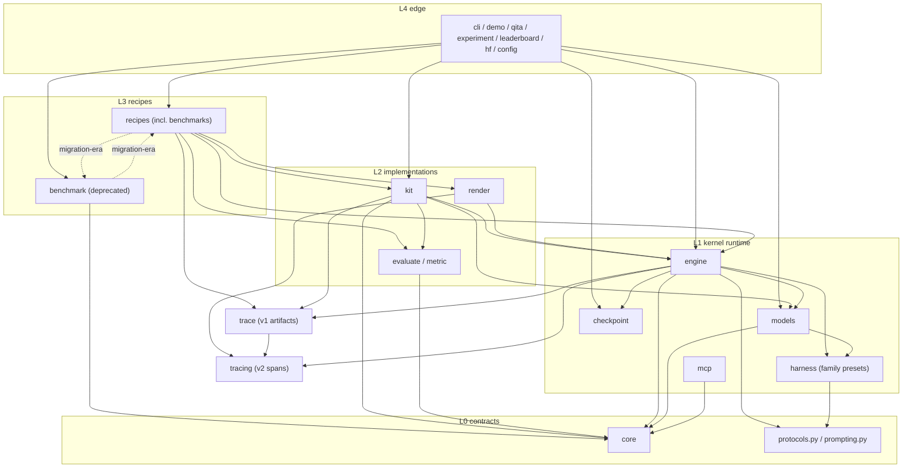

# Module Boundaries

Target dependency structure for the repository, the boundary matrix, and the explicit list of current violations.
Source of truth for rules enforced (with a legacy allowlist) by `tests/test_architecture_boundaries.py`.
See [architecture-audit.md](architecture-audit.md) for how the current system works and [architecture-debt.md](architecture-debt.md) for remediation priorities.

## Layer model

```text
L4  edge/aggregate : cli, demo, qita, experiment, leaderboard, hf, config
L3  recipes        : recipes (incl. recipes.benchmarks), benchmark (deprecated, migrating)
L2  implementations: kit, render, evaluate, metric
L1  kernel runtime : engine, harness(presets), models, mcp, checkpoint
L0  contracts/leaves: core, protocols.py, prompting.py
Sinks (nothing may import them): trace artifacts are files, not imports
```

Dependencies may only point downward (or within the same layer where noted). "Lazy" function-level imports do **not** exempt an edge — they only hide it; new code must not add lazy edges that the rules below forbid.

## Boundary matrix

| Module | Responsibility | Public surface (prefer these) | May depend on | Must not depend on |
| --- | --- | --- | --- | --- |
| `qitos.core` | Agent-execution contracts | `AgentModule`, `StateSchema`, `Decision`, `Action`, `BaseTool`/`FunctionTool`, `ToolRegistry`, `Task`, `Memory`, `History`, `Env`, errors, specs, `AgentSpec` | `protocols`, `prompting` (and lazy kit/engine/trace/render/harness only inside the `AgentModule.run()` convenience path until D2 is resolved) | engine, models, kit, benchmark, recipes, trace*, render, qita, periphery |
| `qitos.protocols` | Model I/O protocol registry + renderers | `get_protocol`, `resolve_protocol_chain`, `render_protocol_prompt` | stdlib only | everything qitos (kit parser lazy import is legacy, see V7) |
| `qitos.prompting` | Prompt spec/builder, framework-owned sections | `PromptSpec`, `build_prompt_spec` | stdlib only | everything qitos |
| `qitos.engine` | Execution kernel: loop, hooks, stop, recovery, interrupts | `Engine`, `AsyncEngine`, `EngineResult`, `EngineHook`, stop criteria, `EngineEvent` | core, protocols, prompting, models, harness, checkpoint, trace, tracing | kit, benchmark, recipes, mcp, cache, render, evaluate, metric, func, periphery (current lazy kit/mcp/cache edges are legacy, see V3) |
| `qitos.harness` | Model family presets + policy types | `FamilyPreset`, `resolve_family_preset`, `build_harness_policy` | protocols | engine, kit, core, models, benchmark, recipes (concrete transports and `build_model_for_preset` live in `qitos.models.harness_adapter`) |
| `qitos.models` | Provider abstraction | `Model`/`AsyncModel`/`ModelFactory`, `OpenAICompatibleModel`, `LiteLLMModel`, profile registries, `build_model_for_preset` | core, protocols, harness | engine, kit, benchmark, recipes, trace, render, periphery |
| `qitos.kit` | Swappable implementations (tools, toolsets, parsers, memory, history, planning, critics, envs, permissions, REPL, skills) | `qitos.kit`, `qitos.kit.toolset` builders, `qitos.kit.tool.<domain>` | core, engine, models, protocols, prompting, evaluate, metric, trace | benchmark, recipes, periphery, root `qitos` package self-import |
| `qitos.trace` | v1 artifact writer/validator (compatibility contract) | `TraceWriter`, `TraceEvent`, `TraceStep`, schema validator | tracing (redaction helper) | engine, kit, core, models, benchmark, recipes |
| `qitos.tracing` | v2 span plane + processors plus an unfrozen Trajectory candidate | `create_trace`, `add_trace_processor`, `TracingProvider`, `EventSink` | core (canonical `ArtifactRef`) | engine, kit, models, benchmark, recipes at module level |
| `qitos.render` | Rich terminal hooks | `ClaudeStyleHook`, `RichConsoleHook` | core, engine, tracing | benchmark, recipes, periphery |
| `qitos.checkpoint` | v2 checkpoint stores | `CheckpointStore`, `Checkpoint`, fork | (self-contained) | everything qitos |
| `qitos.mcp` | MCP servers → tools bridge | `mcp_server_to_function_tools`, `MCPServer` | core | engine, kit, benchmark, recipes |
| `qitos.evaluate` | Trajectory evaluation contracts | `TrajectoryEvaluator`, `EvaluationContext` | core | engine, kit, models, benchmark, recipes |
| `qitos.metric` | Benchmark metric contracts | `Metric`, `MetricInput` | (leaf) | everything qitos |
| `qitos.benchmark` (deprecated) | Legacy benchmark adapters | `BenchmarkAdapter`, runners | core, engine, kit, trace, tracing, recipes (migration-era only) | models, harness, render, evaluate, metric, periphery |
| `qitos.recipes` | Canonical recipes + benchmarks (target home) | `qitos.recipes.benchmarks.*`, method recipes | core, engine, kit, models, trace, render, evaluate, metric, harness, benchmark (migration-era only) | periphery |
| `qitos.config` | Strict declarative launch parsing, credential resolution boundary, and Agent/Engine composition | `load_agent_config`, `CredentialRef`, resolvers, `build_agent_composition`, `run_agent_config` | core, models, engine, kit, checkpoint | benchmark, recipes, periphery |
| `qitos.experiment` | Sweep/concurrent runs | `ExperimentRunner` | core, engine, config, cache, checkpoint | benchmark, recipes, kit, qita |
| `qitos.cli`, `qitos.demo`, `qitos.qita`, `qitos.leaderboard`, `qitos.hf`, `qitos.func`, `qitos.debug`, `qitos.cache` | Edge aggregators / deprecated leaves | CLI commands, `qit demo minimal`, qita commands | anything below them | — (nothing inside `qitos` may import them; `qita -> debug` is a legacy exception) |

## Target dependency graph



The `benchmark <-> recipes` dotted pair is **migration-era tolerated**, not target state; remove both edges when the migration completes.

## Current violations (explicit, do not "fix" silently)

These are encoded in the legacy allowlist of `tests/test_architecture_boundaries.py` so the count can only shrink.

| # | Violation | Where | Debt |
| --- | --- | --- | --- |
| V2 | `benchmark <-> recipes` module-level cycle | `benchmark/*/runner.py` ↔ `recipes/benchmarks/*.py` (5 files each) | D1 |
| V3 | engine → kit/mcp/cache/tracing via lazy imports | `engine/engine.py`, `_env_runtime.py`, `_control_runtime.py`, `_handoff_runtime.py` | D3 |
| V4 | core → engine/kit/trace/render/harness lazy imports (convenience path) | `core/agent_module.py`, `core/agent_spec.py` | D2 |
| V7 | protocols → kit lazy import | `protocols.py:431` | D3 |
| V8 | trace → tracing module + tracing → trace lazy bridge | `trace/writer.py`, `tracing/legacy_processor.py` | D4 |
| V9 | qita → deprecated debug | `qita/_cli_app.py` fork feature | D10 |
| V10 | `evaluate`/`metric` contracts implemented under kit mirrors | `kit/evaluate/`, `kit/metric/` | D9 |

## How to use these rules

- Adding a new module? Place it in a layer, then declare its imports per the matrix. The boundary test fails on any new forbidden edge.
- Fixing a violation? Remove the edge **and** delete its allowlist entry in the same change.
- Unsure where a concept belongs? Apply the domain-neutrality test from `AGENTS.md`: framework material must be expressible in agent-execution vocabulary alone.
