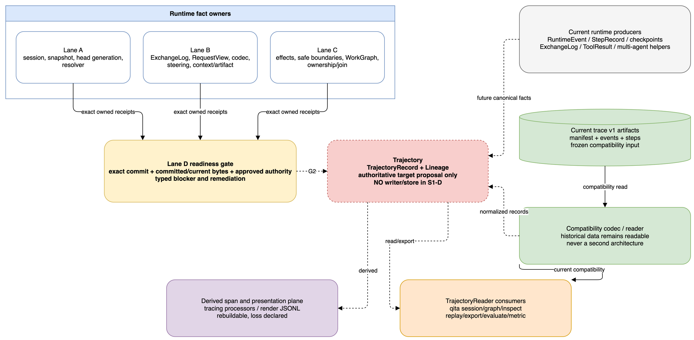

# ADR: one stable Trajectory, lineage, and qita developer contract

Status: proposed, deliberately unfrozen
Decision owner: Lane D for reader/export/DX shape; runtime facts remain owned by
Lanes A, B, and C
Source identity: `c1efb0f4adde3e673bf181af5b1760c19a451ae2`

## Decision

QitOS will expose one future concept named `Trajectory`. Its supporting names
are `TrajectoryRecord`, `TrajectoryStore`, `TrajectoryReader`,
`TrajectoryExporter`, and `Lineage`. A serialized payload may carry an internal
`schema_version`; version suffixes do not appear in public type or product names.

This is a target architecture proposal, not a schema freeze or implementation.
No writer, store, qita behavior, exporter, compression, index, or benchmark is
added by S1-D.

The authoritative target is an ordered, append-oriented stream of producer-owned
facts represented as `TrajectoryRecord`. Exactly one writer target may be
authoritative for a new run after the migration gate. Span processors,
renderer JSONL, indexes, query caches, and external exports are derived and
rebuildable. Current trace artifacts remain readable through one compatibility
codec/reader; that reader is an adapter into `TrajectoryReader`, never a second
architecture.



Editable source: [s1_d_trajectory_architecture.drawio](assets/s1_d_trajectory_architecture.drawio).

## Authority and ownership

Runtime producers own facts:

- Lane A owns session identity, lifecycle, immutable snapshot, authoritative
  head/generation, pause/restore/fork, and resolver-reference facts.
- Lane B owns ExchangeLog, RequestView, provider codec/continuation, steering,
  context, compaction, and artifact facts.
- Lane C owns attempts/effects, safe boundaries, WorkGraph, ownership
  generation, operation semantics, joins, uncertainty, and late/stale rejection.
- Lane D owns the common trajectory envelope, reader/export policy, compatibility
  presentation, qita navigation, loss/privacy declarations, and exact evidence
  gate. Lane D must reference producer payloads; it must not copy their schemas
  or infer absent facts.

When a producer fact is missing, the reader returns a typed blocked/unknown
record. It never derives parentage from a `run_id`, directory, tool name, agent
name, timestamp proximity, or string suffix.

## Target record envelope

The following fields are proposed and remain unfrozen. Producer-owned payloads
are versioned independently and referenced rather than redefined.

| Field | Meaning and invariant |
|---|---|
| `schema_version` | Version of this serialized envelope; not a public type generation |
| `record_id` | Stable identity of one immutable record |
| `sequence` | Store-assigned total order within an authoritative stream; producer order is separately retained |
| `record_kind` | Low-cardinality fact kind, never a free-form UI label |
| `occurred_at` / `recorded_at` | Producer time and persistence time; neither substitutes for ordering |
| `session_id` | Long-lived session identity |
| `run_id` | One execution attempt; never a parent encoding |
| `snapshot_id` | Immutable session snapshot identity owned by Lane A |
| `checkpoint_ref` | Typed reference to checkpoint persistence, not copied checkpoint state |
| `head_generation` | Expected/committed authoritative session-head generation |
| `work_item_id` | Durable unit of work owned by one agent |
| `attempt_id` | One execution attempt for an effect or work item |
| `owner` | Resolvable agent/worker identity plus authority scope |
| `owner_generation` | Generation that is allowed to advance this work head |
| `causation_id` / `correlation_id` | Explicit causal/correlation references; never inferred from time or names |
| `payload_ref` | Reference to the producer-owned versioned payload or content-addressed artifact |
| `privacy_view` | `raw_private` or a named public/redacted policy |
| `loss` | Machine-readable omission, normalization, redaction, uncertainty, and completeness declaration |

## Lineage facts

`Lineage` is the explicit relation view over records, not a directory convention.
The canonical facts must be able to express:

| Fact | Required fields |
|---|---|
| Parent work | `work_item_id`, `parent_work_item_id`, explicit `edge_kind`, producer record ID |
| Handoff | same `work_item_id`, from/to owner, expected and committed owner generation, context-transfer receipt |
| Delegate/spawn | parent and child work/session IDs, declaration order, supervision/cancellation policy |
| Fan-out | `fan_out_group_id`, declared ordered child set, creation snapshot/checkpoint |
| Join dependency | join ID, policy, expected/terminal/outstanding child IDs, accepted results, join generation |
| Pause | lifecycle before/after, request and safe-boundary record, last safe snapshot, quiescence state |
| Restore | source snapshot/checkpoint, prior and new run IDs, acquired head/owner generation, resolver report |
| Fork | source session/snapshot/work, new isolated session/work/head, cause; source head unchanged |
| Steering | steering ID, queued record, target safe boundary, applied-once record or pending state |
| Context transfer | policy, selected/referenced/transformed/omitted facts, loss and capability receipt |
| Effect state | attempt ID, idempotency/reconciliation refs, `not_started`, `started`, `committed`, `failed`, or `outcome_unknown` |
| Late result | attempt/worker generation, closed/superseded target generation, rejection record, observed uncertainty |
| Stale owner rejection | expected/current owner and generation, rejected mutation, no-head-change proof |
| Uncertainty | subject, scope, reason code, reconciliation requirement, automatic-retry prohibition |
| Loss declaration | policy, affected record/field class, count/digest where safe, replay/export consequence |

No absent identity is encoded as an empty string that qita later guesses. Missing
facts produce typed findings such as `missing_lineage`, `inferred_edge`,
`conflicting_identities`, or `consumer_not_qualified`.

## Canonical, derived, and compatibility planes

| Plane | Target role | Write authority | Fidelity | Retirement rule |
|---|---|---|---|---|
| `Trajectory` | Only future authoritative execution-history target | One selected writer after G4/G5 review | Producer facts plus explicit uncertainty/loss | Not implemented in S1-D |
| Tracing spans/processors | Derived diagnostic/export plane | Rebuilt from canonical records or explicitly correlated live input | May be selective; loss declared | Cannot be a second store or qita truth |
| Renderer JSONL | Derived presentation/cache plane | Render adapter only | Display-oriented and lossy | Stop treating as stored truth after reader parity |
| Current trace artifacts | Frozen compatibility source | Existing writer remains during migration | Existing known losses preserved | Reader retained; write deprecation only after release review |
| Compatibility reader | Normalizes current artifacts into `TrajectoryReader` results | Read-only adapter | Declares gaps and malformed-input policy | Retire only after archive/support policy and external evidence |
| Checkpoint store | Continuation/durability truth | Lane A/checkpoint owner | Snapshot state, not trajectory history | Referenced, never merged into TrajectoryStore |

### Migration gate

The authoritative writer may change only after:

1. Lane A, C, then B producer contracts are accepted at exact commits.
2. S1 receipts bind committed and current fixture/evidence bytes and an approved
   integration authority.
3. The single-agent continuity slice and durable work graph produce explicit
   lineage, effects, uncertainty, and completeness facts.
4. Compatibility import and qita reader parity pass on current archives.
5. Raw/private and public/redacted views pass independent privacy and fidelity
   tests.
6. The representative benchmark actually runs; any storage/compression/index
   decision cites measurements rather than architecture preference.

Until then, readiness remains `schema_not_ready`, the current trace writer stays
the compatibility writer, and no canonical Trajectory writer exists.

## Beginner qita flow

The future beginner flow starts at a session, not a run directory:

```text
$ qita session research-42
Session research-42 · paused
Head generation 7 · snapshot snap-07 · recoverable: yes
Last safe boundary: tool batch closed
Running work: 2 · pending joins: 1 · queued steering: 1
Uncertain effects: 0
Next: qita resume research-42

$ qita graph research-42
root(work-main, owner=planner)
└── delegate(work-evidence, owner=researcher, waiting_input)
    └── fan-out group gather-3: 2 complete, 1 running, join pending

$ qita inspect work-evidence
Status: waiting_input · owner generation 3
Last safe snapshot: snap-06 · recoverable: yes
Why stopped: input_required
Next: qita resume research-42 --input <value>
```

The summary must show session state, authoritative head, last safe snapshot,
recoverability, active work, graph, owner, joins, uncertain effects, steering,
pause/restore/fork lineage, failure reason, and one actionable remediation. A
beginner never has to open a receipt, correlate run directories, or compute a
digest.

## Advanced lineage inspection

Advanced inspection may add `--view raw-private` only with explicit local
authorization; the default is a named public/redacted view. Stable filters are
identity and fact based:

```text
qita inspect work-evidence --lineage
qita inspect work-evidence --attempt attempt-4 --effects
qita graph research-42 --at-generation 7
qita session research-42 --show uncertainty,steering,loss
```

Output distinguishes declaration, completion, and reduction order; prior and
current owners; accepted and discarded results; source and target snapshot;
effect versus head-commit status; and producer fact versus compatibility gap.
It never presents trace/tracing as two peer products.

## Resume and fork discoverability

`qita session` always prints `recoverable`, the last safe snapshot, and a
suggested next command. `qita resume <session-id>` is a thin client of Lane A's
runtime semantics. `qita fork <session-id> --snapshot <snapshot-id>` creates a
new session only through the runtime API and then shows both source and child
lineage. qita never copies trace files to pretend that execution state was
forked.

If a session is not recoverable, the output says which precondition failed:

```text
blocked [quiescence_required]
Owner: lane_c
Reason: a worker may still commit into generation 7
Required: quiescence/effect receipt for attempt-4
Next: reconcile the worker or cancel through the runtime owner, then snapshot
```

## Error and remediation language

Every blocker contains stable `code`, `owner`, `short_message`, `remediation`,
`required_artifact`, and `current_qualification_state`. Messages avoid opaque
contract IDs as the only explanation. Codes stay low-cardinality; identities
and paths stay in structured fields. A rejected secret, host path, provider
payload, token, header, or cookie is reported only by finding code and safe
field position, never by echoing its value.

Normal blocked execution exits non-zero. Dry-run exits zero for inspection but
does not turn blocked into pass.

## Privacy and portability

- Raw/private capture and public/redacted projection are different views with
  different authorization and retention policy.
- Sanitization transforms or removes unsafe content and emits a reproducible
  transform receipt. Hashing proves byte identity; it does not sanitize the
  hashed content.
- Public views exclude secrets, tokens, headers, cookies, raw provider payload,
  opaque reasoning, host paths, file URIs, home expansion, local endpoints, and
  unauthorized campaign payloads.
- Artifact identity is a typed reference/digest plus policy metadata, never a
  host path. Findings do not echo rejected originals.
- Every exporter declares privacy policy and loss. Only the canonical private
  form may later claim exact re-import, and only after tests establish it.

## Public surface budget

S1-D adds zero root exports and zero qita commands. The future budget is:

- six public concepts: `Trajectory`, `TrajectoryRecord`, `TrajectoryStore`,
  `TrajectoryReader`, `TrajectoryExporter`, and `Lineage`;
- one `qita` product with `session`, `graph`, `inspect`, `resume`, and `fork`
  verbs added only after their runtime owners exist;
- one canonical storage target, one compatibility reader family, and derived
  exporters/processors that do not become public storage generations.

Producer payload classes remain in their owning modules. Internal schema
versions do not create new public `V1`, `V2`, `Legacy`, or `Next` types.

## Current trace compatibility presentation

Existing runs appear in qita as `compatibility source: current trace` with
explicit gaps such as unavailable session head, snapshot, work item, owner
generation, or join lineage. Current `parent_run_id` metadata may be displayed
as unverified compatibility metadata, but it cannot become a parent edge unless
a producer fact qualifies it. Delegate/fan-out run-name suffixes are never
parsed for lineage.

## Rejected dual-trace architecture

Rejected: keeping current trace artifacts and tracing spans as two equal,
long-lived products, or introducing separately named trajectory/qita
generations. It duplicates ordering, identity, redaction, retention, and reader
semantics; makes failures disagree; and forces researchers to choose a truth.
The accepted direction is one `Trajectory`, derived spans/presentation, and one
bounded compatibility reader for historical artifacts.

## Removal ledger

| Current surface | Target disposition | Removal prerequisite |
|---|---|---|
| Direct qita reads of current files | Compatibility reader behind `TrajectoryReader` | Reader parity for board/replay/export plus malformed-input policy |
| qita dependency on `debug.ReplaySession` | Canonical reader/replay/fork clients | Runtime-owned fork and replay parity; announced compatibility window |
| Tracing legacy writer processor | Explicit derived/compatibility adapter | Correlation, step, failure, and external-consumer evidence |
| Renderer JSONL as stored truth | Derived view/cache only | Render/query parity from `TrajectoryReader` |
| Run-name parent conventions | Never canonical | Explicit producer lineage available; compatibility gaps visible |
| Current trace writer default | Compatibility writer during migration | Canonical writer, importer, parity, archive policy, release review |

Repository search alone never proves that a surface has no external consumer.

## Current readiness and unsupported claims

At the S1-D source identity, A/B/C S1 producer versions, commits, fixture/evidence
paths, and digests are unestablished. Only the two accepted G1 foundation
receipts for ExchangeLog and ToolResult can qualify. Therefore:

- schema remains not ready;
- no canonical writer or store benchmark exists;
- publication, compression, deduplication, performance, and qita migration
  claims are unavailable;
- all receipts present would still leave runtime behavior unqualified;
- this ADR implements no new trajectory runtime.
