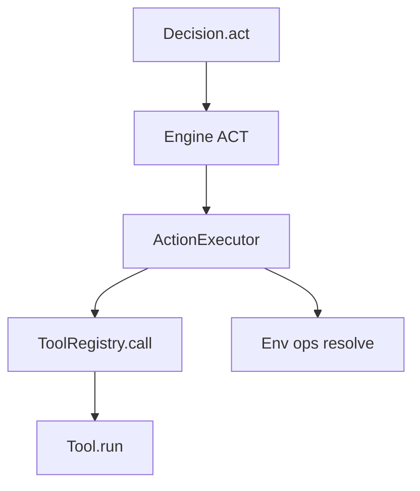

# Tools & ToolRegistry

## Goal

Learn how QitOS represents tools and dispatches them during `ACT`.

## Tool registration

Tools are registered via `ToolRegistry`.

You can register:

1. function tools
2. class-based tools
3. tool sets (a bundle of tools)

## Function tool (recommended)

Use `@tool` to attach name/description/ops requirements without changing function semantics.

```python
from qitos import ToolRegistry, tool

@tool(name="add", description="Add two integers.")
def add(a: int, b: int) -> int:
    return a + b

registry = ToolRegistry().register(add)
```

## Class-based tool

If you need configuration (workspace root, credentials, caches), wrap methods on a class and use `ToolRegistry.include(...)`.

```python
from qitos import ToolRegistry, tool

class MathTools:
    def __init__(self, bias: int = 0):
        self.bias = bias

    @tool(name="add_bias", description="Add two ints plus a configured bias.")
    def add_bias(self, a: int, b: int) -> int:
        return a + b + self.bias

registry = ToolRegistry().include(MathTools(bias=3))
```

## Tool sets (bundle + lifecycle)

When a bundle needs setup/teardown or namespaces, use ToolSet and `register_toolset(...)`.

```python
from typing import Any
from qitos import ToolRegistry, tool

class MyToolSet:
    name = "myset"
    version = "1"

    def setup(self, context: dict[str, Any]) -> None:
        pass

    def teardown(self, context: dict[str, Any]) -> None:
        pass

    def tools(self):
        @tool(name="ping")
        def ping() -> str:
            return "pong"
        return [ping]

registry = ToolRegistry().register_toolset(MyToolSet(), namespace="util")
# tool name becomes: util.ping
```

## Env/ops injection (advanced, but important)

Tools can declare required ops groups (e.g. `file`, `process`, `web`). During execution, Engine resolves those ops from the selected `Env`
and passes them through `runtime_context` and optional injected parameters:

- `runtime_context`: always available if your tool accepts it
- `env`: injected when your tool signature includes `env`
- `ops`: injected when your tool signature includes `ops`
- `file_ops` / `process_ops`: injected when your tool signature includes them

That is how the same “tool semantics” can run on different backends (host/docker/remote) as long as the Env supports the required ops groups.

## Tool execution path



## Predefined Tool Packages (`qitos.kit.tool`)

Use these as off-the-shelf components, similar to using `torch.nn` blocks.

- Editor bundle:
  - `EditorToolSet` (`view`, `create`, `str_replace`, `insert`, `search`, `list_tree`, `replace_lines`)
- EPUB bundle:
  - `EpubToolSet` (`list_chapters`, `read_chapter`, `search`)
- File tools:
  - `WriteFile`, `ReadFile`, `ListFiles`
- Process tool:
  - `RunCommand`
- HTTP/Web tools:
  - `HTTPRequest`, `HTTPGet`, `HTTPPost`, `HTMLExtractText`
- Text-browser tools:
  - `WebSearch`, `VisitURL`, `PageDown`, `PageUp`, `FindInPage`, `FindNext`, `ArchiveSearch`
- Thinking toolset:
  - `ThinkingToolSet`, `ThoughtData`
- Tool libraries:
  - `InMemoryToolLibrary`, `ToolArtifact`, `BaseToolLibrary`
- Registry builders:
  - `math_tools()`, `editor_tools(workspace_root)`

Import pattern:

```python
from qitos.kit.tool import EditorToolSet, RunCommand, HTTPGet, ThinkingToolSet
```

## Predefined Planning Primitives (`qitos.kit.planning`)

- LLM orchestration:
  - `ToolAwareMessageBuilder`, `LLMDecisionBlock`
- Plan utilities:
  - `PlanCursor`, `parse_numbered_plan`
- Search strategies:
  - `GreedySearch`, `DynamicTreeSearch`
- State helpers:
  - `append_log`, `format_action`, `set_final`, `set_if_empty`

Import pattern:

```python
from qitos.kit.planning import DynamicTreeSearch, PlanCursor, LLMDecisionBlock
```

## Source Index

- [qitos/core/tool.py](https://github.com/Qitor/qitos/blob/main/qitos/core/tool.py)
- [qitos/core/tool_registry.py](https://github.com/Qitor/qitos/blob/main/qitos/core/tool_registry.py)
- [qitos/engine/action_executor.py](https://github.com/Qitor/qitos/blob/main/qitos/engine/action_executor.py)
- [qitos/kit/tool/toolset.py](https://github.com/Qitor/qitos/blob/main/qitos/kit/tool/toolset.py)
- [qitos/kit/tool/__init__.py](https://github.com/Qitor/qitos/blob/main/qitos/kit/tool/__init__.py)
- [qitos/kit/planning/__init__.py](https://github.com/Qitor/qitos/blob/main/qitos/kit/planning/__init__.py)
