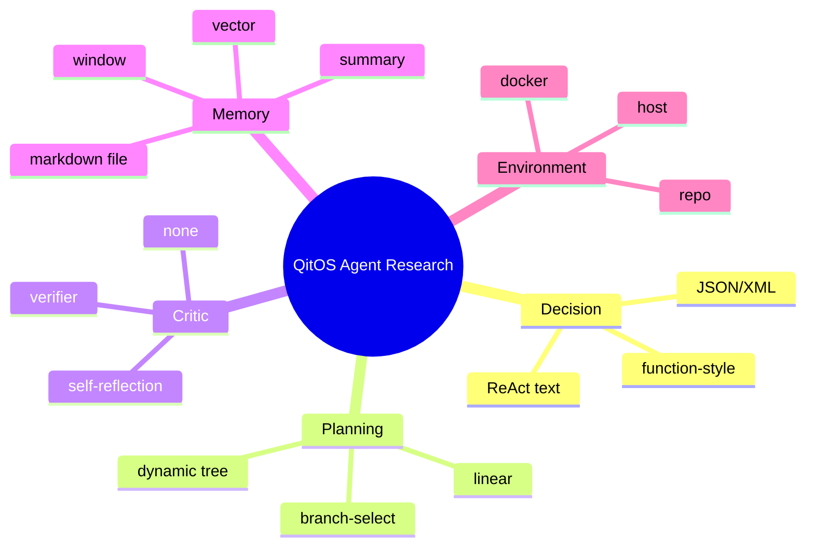
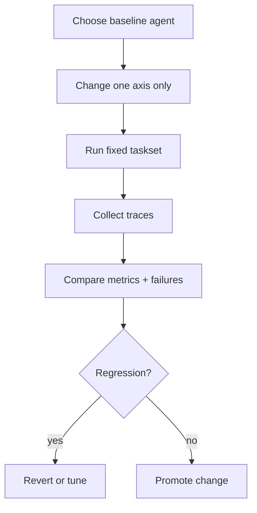

# Design New Agents

## Goal

Design new agent methods while keeping code changes local and interpretable.

## High-leverage extension axes

1. **Decision format**: ReAct text / JSON / XML / function-style output.
2. **Planning/search**: linear plan, dynamic tree, branch select.
3. **Critic**: self-reflection, verifier, task-specific critic.
4. **Memory**: window, summary, vector, file-backed memory.
5. **Env backend**: host, repo, docker.

## Research design mindmap

## Tutorial: turn PlanAct into Tree-style planning

1. Start from `examples/patterns/planact.py`.
2. Keep state fields unchanged initially.
3. Add branch state fields (`frontier`, `scores`, `visited`) to `StateSchema`.
4. Update `decide` to emit branch candidates.
5. Update `reduce` to track selected branch and prune logic.
6. Keep stop logic unchanged first; then tune with criteria.

## Tutorial: add model self-reflection safely

1. Keep primary actor unchanged.
2. Add a critic component that returns structured output.
3. Only allow critic actions: `continue`, `retry`, `stop`.
4. Ensure critic output is recorded in trace payload.

## Innovation workflow (recommended)

## Design rules for publishable experiments

1. Change one axis per branch.
2. Keep prompts versioned.
3. Keep parser behavior deterministic where possible.
4. Add one failure-case test for every new parsing rule.

## Source Index

- [examples/patterns/planact.py](https://github.com/Qitor/qitos/blob/main/examples/patterns/planact.py)
- [examples/patterns/reflexion.py](https://github.com/Qitor/qitos/blob/main/examples/patterns/reflexion.py)
- [qitos/kit/parser/json_parser.py](https://github.com/Qitor/qitos/blob/main/qitos/kit/parser/json_parser.py)
- [qitos/kit/parser/xml_parser.py](https://github.com/Qitor/qitos/blob/main/qitos/kit/parser/xml_parser.py)
- [qitos/kit/planning/dynamic_tree_search.py](https://github.com/Qitor/qitos/blob/main/qitos/kit/planning/dynamic_tree_search.py)
- [qitos/kit/memory/window_memory.py](https://github.com/Qitor/qitos/blob/main/qitos/kit/memory/window_memory.py)
