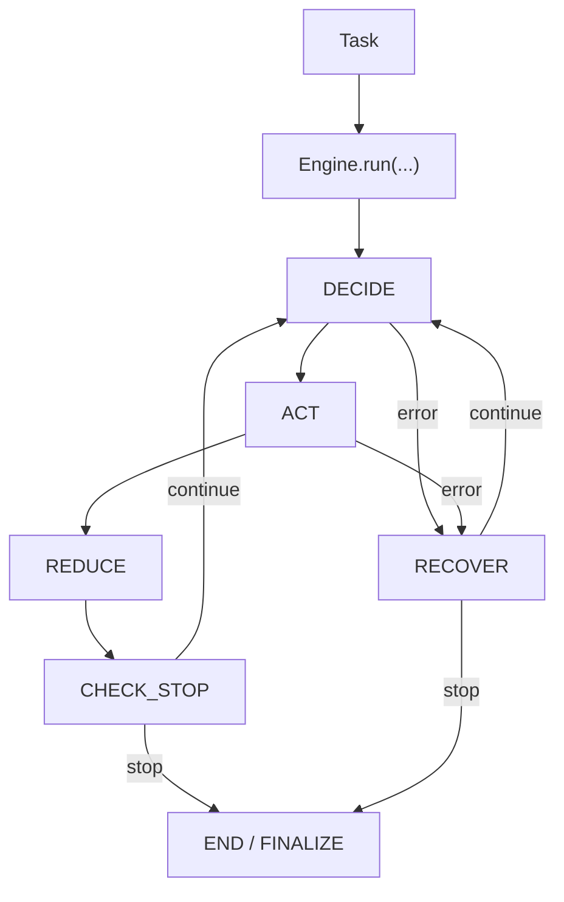

# Kernel Architecture

## Stable contracts

1. `AgentModule`
2. `Engine`
3. `StateSchema`
4. `Decision` / `Action`
5. `Task` / `Env` / `Memory`

## Canonical execution chain

`DECIDE -> ACT -> REDUCE -> CHECK_STOP` (loop)

- `prepare(state)` is used inside DECIDE when model path is active.
- no separate agent-level `observe` phase.

## Architecture map

## Responsibility boundaries

- AgentModule: policy semantics (`prepare/decide/reduce`)
- Engine: orchestration/runtime semantics
- ToolRegistry + Env: execution surface
- Hooks + Trace: observability side-channels

## Minimal skeleton

See [AgentModule API](../reference/agent_module.md).

## Source Index

- [qitos/core/agent_module.py](https://github.com/Qitor/qitos/blob/main/qitos/core/agent_module.py)
- [qitos/engine/engine.py](https://github.com/Qitor/qitos/blob/main/qitos/engine/engine.py)
