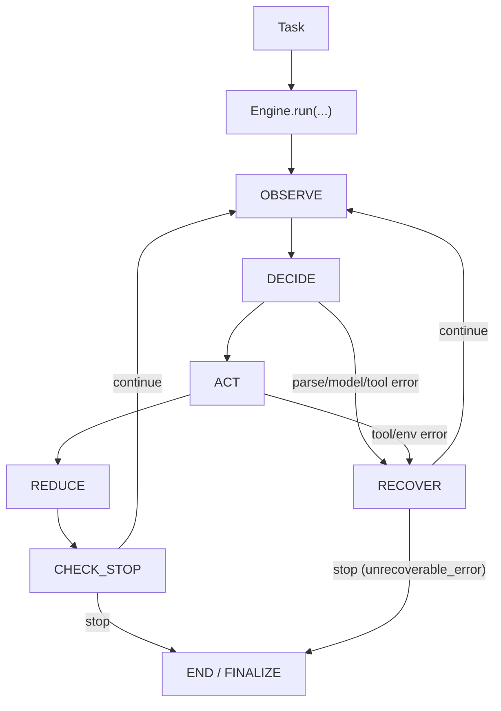
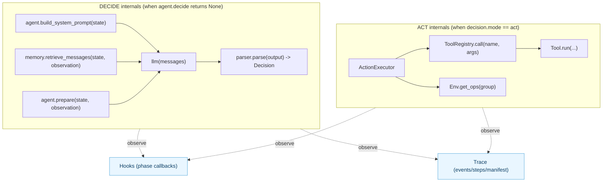
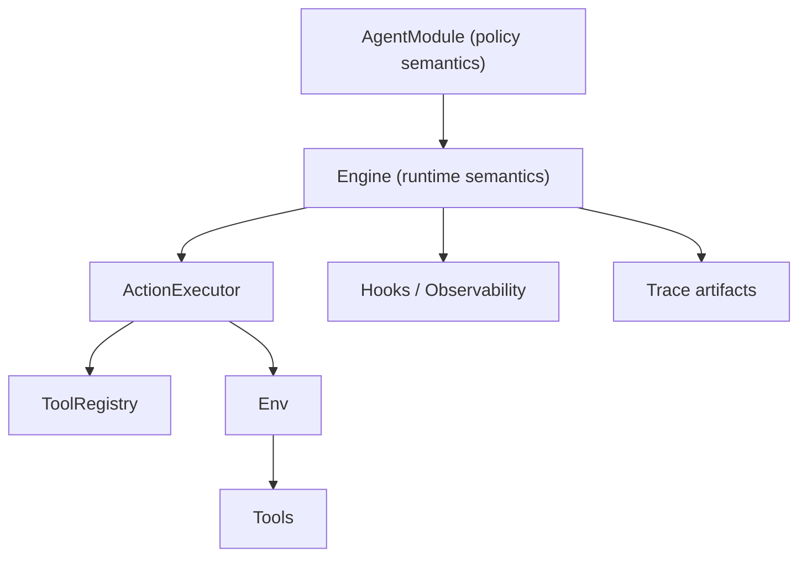

# Kernel Architecture

## Goal

Understand exactly what is stable, what is extensible, and where your research logic should live.

## Stable contracts

1. `AgentModule`
2. `Engine`
3. `StateSchema`
4. `Decision` / `Action`
5. `Task` / `Env` / `Memory`

## Canonical runtime loop

1. `observe`
2. `decide`
3. `act`
4. `reduce`
5. `check_stop`

This makes behavior easy to inspect and compare across agents.

For phase-by-phase semantics (inputs/outputs/invariants/errors), read:

- [Engine Loop Deep Dive](kernel_deep_dive.md)

## Architecture map

### Lifecycle map (single control flow)



### Runtime wiring map (inside phases)



Notes:

- The only control flow is `OBSERVE -> DECIDE -> ACT -> REDUCE -> CHECK_STOP` in a loop.
- Memory/model/parser are **implementation details inside DECIDE** (Engine model path).
- ToolRegistry/Env ops are **implementation details inside ACT**.
- Hooks/Trace are **observability side-channels**, not alternate execution paths.

## Where to put your logic

- In `AgentModule.observe`: construct observation from state + env view.
- In `AgentModule.decide`: return a `Decision` or `None` to let Engine call model.
- In `AgentModule.reduce`: update state using decision + action results.

## Responsibility boundaries



## Minimal example skeleton

```python
from dataclasses import dataclass, field
from typing import Any

from qitos import Action, AgentModule, Decision, Engine, StateSchema, ToolRegistry, tool
from qitos.kit.parser import ReActTextParser
from qitos.models import OpenAICompatibleModel

@dataclass
class MyState(StateSchema):
    scratchpad: list[str] = field(default_factory=list)

@tool(name="add")
def add(a: int, b: int) -> int:
    return a + b

class MyAgent(AgentModule[MyState, dict[str, Any], Action]):
    def __init__(self, llm):
        registry = ToolRegistry()
        registry.register(add)
        super().__init__(tool_registry=registry, llm=llm, model_parser=ReActTextParser())

    def init_state(self, task: str, **kwargs: Any) -> MyState:
        return MyState(task=task, max_steps=6)

    def observe(self, state: MyState, env_view: dict[str, Any]) -> dict[str, Any]:
        return {"task": state.task, "recent": state.scratchpad[-6:]}

    def build_system_prompt(self, state: MyState) -> str | None:
        return "Return ReAct format. Use Action: add(a=..., b=...) or Final Answer: ..."

    def prepare(self, state: MyState, observation: dict[str, Any]) -> str:
        return f"Task: {observation['task']}\nRecent: {observation['recent']}"

    def decide(self, state: MyState, observation: dict[str, Any]):
        return None  # Engine calls llm(messages) and parses output into Decision

    def reduce(self, state: MyState, observation: dict[str, Any], decision: Decision[Action], action_results: list[Any]) -> MyState:
        if decision.rationale:
            state.scratchpad.append(f"Thought: {decision.rationale}")
        if decision.actions:
            state.scratchpad.append(f"Action: {decision.actions[0]}")
        if action_results:
            state.scratchpad.append(f"Observation: {action_results[0]}")
        return state

llm = OpenAICompatibleModel(model="Qwen/Qwen3-8B")  # reads OPENAI_BASE_URL / OPENAI_API_KEY
result = Engine(agent=MyAgent(llm)).run("compute 19+23")
print(result.state.final_result, result.state.stop_reason)
```

## Common mistakes

1. Putting orchestration logic outside `Engine`.
2. Encoding stop semantics in random strings instead of standardized stop reasons.
3. Making state implicit in local variables instead of `StateSchema` fields.

## Source Index

- [qitos/core/agent_module.py](https://github.com/Qitor/qitos/blob/main/qitos/core/agent_module.py)
- [qitos/core/state.py](https://github.com/Qitor/qitos/blob/main/qitos/core/state.py)
- [qitos/core/task.py](https://github.com/Qitor/qitos/blob/main/qitos/core/task.py)
- [qitos/core/env.py](https://github.com/Qitor/qitos/blob/main/qitos/core/env.py)
- [qitos/engine/engine.py](https://github.com/Qitor/qitos/blob/main/qitos/engine/engine.py)
- [qitos/engine/hooks.py](https://github.com/Qitor/qitos/blob/main/qitos/engine/hooks.py)
