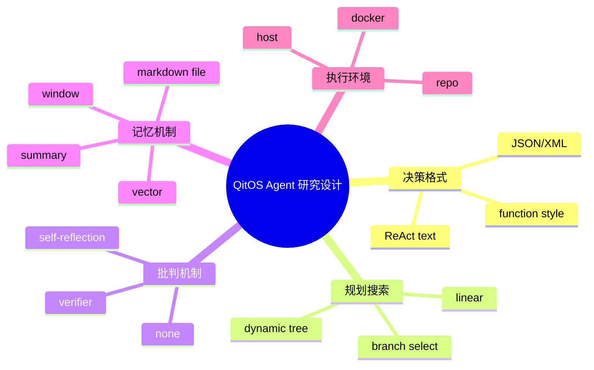
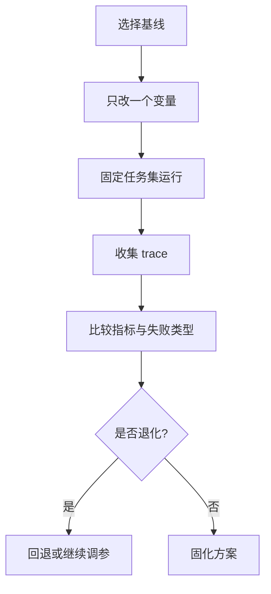

# 新 Agent 设计方法

## 目标

在保持可解释性与可比较性的前提下，持续做方法创新。

## 高价值扩展轴

1. **决策格式**：ReAct 文本 / JSON / XML / 函数式。
2. **规划与搜索**：线性规划 / 分支选择 / 动态树。
3. **批判与反思**：无 critic / 自反思 / 验证器 critic。
4. **记忆机制**：window / summary / vector / markdown file。
5. **执行环境**：host / repo / docker。

## 研究设计导图

## 推荐创新流程图

## Source Index

- [examples/patterns/planact.py](https://github.com/Qitor/qitos/blob/main/examples/patterns/planact.py)
- [examples/patterns/reflexion.py](https://github.com/Qitor/qitos/blob/main/examples/patterns/reflexion.py)
- [qitos/kit/parser/json_parser.py](https://github.com/Qitor/qitos/blob/main/qitos/kit/parser/json_parser.py)
- [qitos/kit/parser/xml_parser.py](https://github.com/Qitor/qitos/blob/main/qitos/kit/parser/xml_parser.py)
- [qitos/kit/planning/dynamic_tree_search.py](https://github.com/Qitor/qitos/blob/main/qitos/kit/planning/dynamic_tree_search.py)
- [qitos/kit/memory/window_memory.py](https://github.com/Qitor/qitos/blob/main/qitos/kit/memory/window_memory.py)
