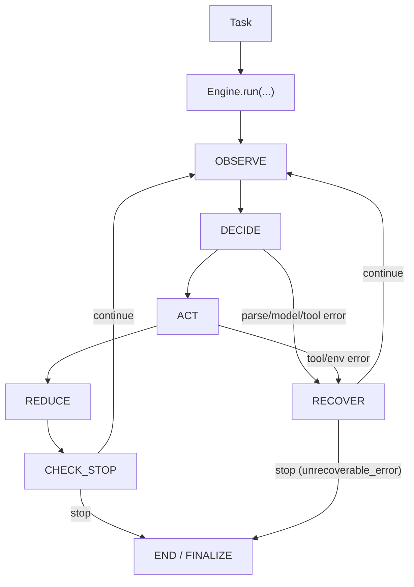
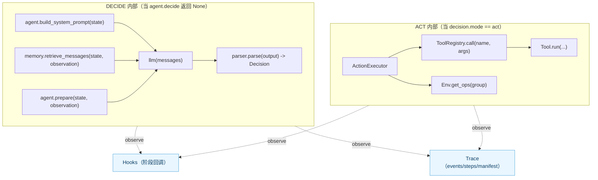
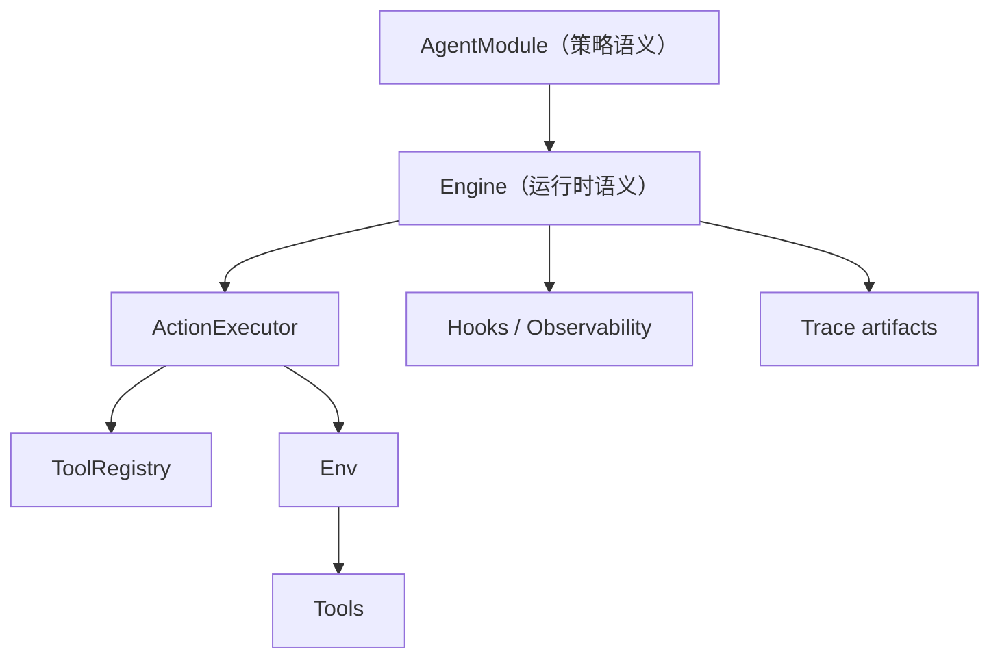

# 内核架构

## 目标

搞清楚哪些接口是稳定契约，哪些是可替换扩展点，以及你的研究代码应该放在哪一层。

## 稳定契约

1. `AgentModule`
2. `Engine`
3. `StateSchema`
4. `Decision` / `Action`
5. `Task` / `Env` / `Memory`

## 统一执行循环

1. `observe`
2. `decide`
3. `act`
4. `reduce`
5. `check_stop`

这套显式循环是可调试、可复现、可比较的基础。

如果你想看每个 phase 的语义契约（输入/输出/不变量/错误与恢复），见：

- [Engine 循环深度拆解](kernel_deep_dive.md)

## 架构总览图

### 生命周期图（唯一控制流）



### 阶段内部接线图（相位内实现）



说明：

- 唯一控制流是 `OBSERVE -> DECIDE -> ACT -> REDUCE -> CHECK_STOP` 的循环。
- memory/model/parser 是 **DECIDE 阶段内部实现细节**（Engine 模型路径）。
- ToolRegistry/Env ops 是 **ACT 阶段内部实现细节**。
- hooks/trace 属于 **可观测性旁路**，不改变执行路径。

## 职责边界图



## 最小可运行示例（带大模型）

这个例子故意做到“最小但完整闭环”：

- `AgentModule.decide(...)` 返回 `None`，让 `Engine` 走内置的模型调用路径（组装 messages -> 调用 LLM -> parser 解析成 `Decision`）。
- 使用 `ReActTextParser` 解析 ReAct 文本输出，并通过 `ToolRegistry` 调用工具。

```python
from dataclasses import dataclass, field
from typing import Any

from qitos import Action, AgentModule, Decision, Engine, StateSchema, ToolRegistry, tool
from qitos.kit.parser import ReActTextParser
from qitos.models import OpenAICompatibleModel

@dataclass
class MyState(StateSchema):
    scratchpad: list[str] = field(default_factory=list)

@tool(name="add")
def add(a: int, b: int) -> int:
    return a + b

class MyAgent(AgentModule[MyState, dict[str, Any], Action]):
    def __init__(self, llm):
        registry = ToolRegistry()
        registry.register(add)
        super().__init__(tool_registry=registry, llm=llm, model_parser=ReActTextParser())

    def init_state(self, task: str, **kwargs: Any) -> MyState:
        return MyState(task=task, max_steps=6)

    def observe(self, state: MyState, env_view: dict[str, Any]) -> dict[str, Any]:
        return {"task": state.task, "recent": state.scratchpad[-6:]}

    def build_system_prompt(self, state: MyState) -> str | None:
        return "Return ReAct format. Use Action: add(a=..., b=...) or Final Answer: ..."

    def prepare(self, state: MyState, observation: dict[str, Any]) -> str:
        return f"Task: {observation['task']}\nRecent: {observation['recent']}"

    def decide(self, state: MyState, observation: dict[str, Any]):
        return None  # 交给 Engine：llm(messages) + parser.parse(output) -> Decision

    def reduce(
        self,
        state: MyState,
        observation: dict[str, Any],
        decision: Decision[Action],
        action_results: list[Any],
    ) -> MyState:
        if decision.rationale:
            state.scratchpad.append(f"Thought: {decision.rationale}")
        if decision.actions:
            state.scratchpad.append(f"Action: {decision.actions[0]}")
        if action_results:
            state.scratchpad.append(f"Observation: {action_results[0]}")
        return state

# OpenAICompatibleModel 默认从环境变量读取：
# - OPENAI_BASE_URL
# - OPENAI_API_KEY
llm = OpenAICompatibleModel(model="Qwen/Qwen3-8B")

result = Engine(agent=MyAgent(llm)).run("compute 19+23")
print(result.state.final_result, result.state.stop_reason)
```

## 常见误区

1. 把流程编排逻辑写在 `Engine` 之外，导致不可回放、不可比较。
2. 用随意字符串表达停止语义，而不是使用统一 stop_reason（会导致 trace 和统计不可用）。
3. 状态散落在局部变量里，而不是收口到 `StateSchema` 字段（会导致 debug/trace 断裂）。

## Source Index

- [qitos/core/agent_module.py](https://github.com/Qitor/qitos/blob/main/qitos/core/agent_module.py)
- [qitos/core/state.py](https://github.com/Qitor/qitos/blob/main/qitos/core/state.py)
- [qitos/core/task.py](https://github.com/Qitor/qitos/blob/main/qitos/core/task.py)
- [qitos/core/env.py](https://github.com/Qitor/qitos/blob/main/qitos/core/env.py)
- [qitos/engine/engine.py](https://github.com/Qitor/qitos/blob/main/qitos/engine/engine.py)
- [qitos/engine/hooks.py](https://github.com/Qitor/qitos/blob/main/qitos/engine/hooks.py)
