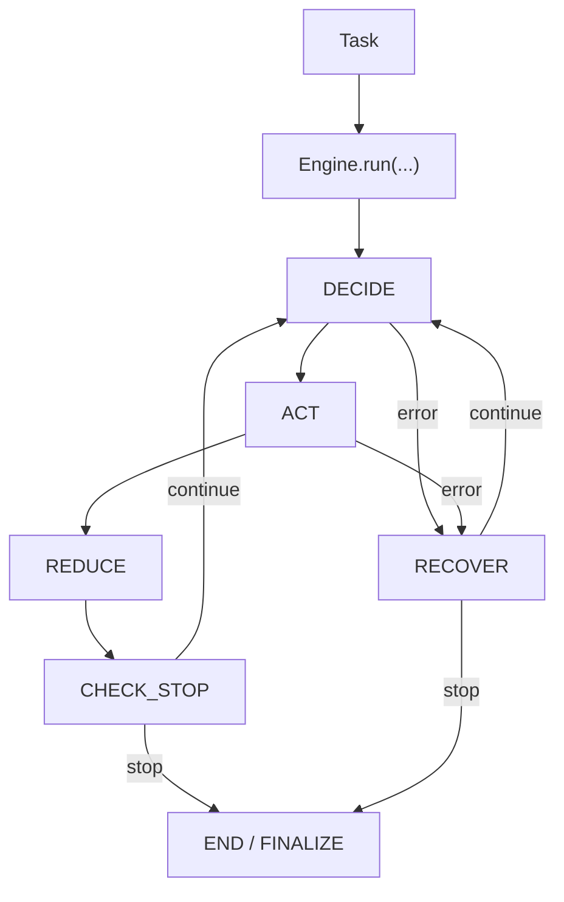

# 内核架构

## 稳定契约

1. `AgentModule`
2. `Engine`
3. `StateSchema`
4. `Decision` / `Action`
5. `Task` / `Env` / `Memory`

## 标准执行链路

`DECIDE -> ACT -> REDUCE -> CHECK_STOP`（循环）

- `prepare(state)` 在 DECIDE 的模型路径内部使用。
- 不再有独立的 agent `observe` 阶段。

## 架构图

## 职责边界

- AgentModule：策略语义（`prepare/decide/reduce`）
- Engine：运行时语义
- ToolRegistry + Env：执行面
- Hooks + Trace：可观测侧路
